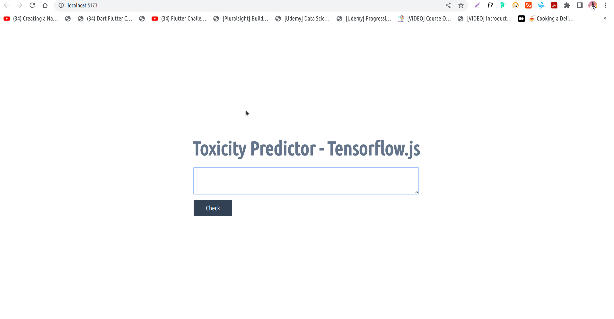

# Detecting Online Toxicity with Tensorflow.js



> This is a simple web app that uses TensorFlow.js and a pre-trained toxicity model to predict whether a given sentence is toxic or not. The app is built with SvelteKit and styled with Tailwind CSS, and features a loading spinner, a fly animation, and a CSS animation using keyframes.

## How It Works

The app consists of a single page (`+page.svelte`) with a form that takes a sentence as input and a "Check" button to submit it. When the user clicks the button, the app loads the toxicity model, classifies the sentence, and displays the results in a scrollable panel.

The app also features a loading spinner while the model is being loaded, a fly animation when the results are displayed, and a CSS animation that makes the title pulse continuously.

## Developing

Once you've forked, cloned the project and installed dependencies with `npm install` (or `pnpm install` or `yarn`), start a development server:

```bash
pnpm run dev
```

## Building

To create a production version of your app:

```bash
pnpm run build
```

You can preview the production build with `npm run preview`.

> To deploy your app, you may need to install an [adapter](https://kit.svelte.dev/docs/adapters) for your target environment.
